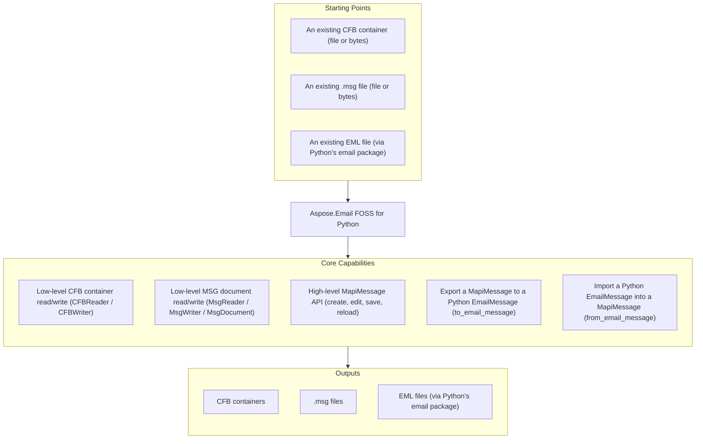

# Aspose.Email FOSS for Python

[](https://pypi.org/project/aspose-email-foss/) [](https://pypi.org/project/aspose-email-foss/) [](https://github.com/aspose-email-foss/Aspose.Email-FOSS-for-Python/actions/workflows/ci.yml) [](LICENSE) [](https://github.com/aspose-email-foss/Aspose.Email-FOSS-for-Python/graphs/contributors)

[](https://products.aspose.org/email/python/)

Aspose.Email FOSS for Python is a free, open-source, MIT-licensed, pure-Python library for
deterministic Compound File Binary (CFB) and Outlook `.msg` message processing — no Microsoft
Outlook installation, COM interop, or compiled extensions required. It provides low-level CFB and
MSG readers/writers alongside a high-level, mutable `MapiMessage` API for creating, editing, and
saving messages, including two-way conversion with Python's own
[`email.message.EmailMessage`](https://docs.python.org/3/library/email.message.html#email.message.EmailMessage).

## Navigation

- [At a Glance](#at-a-glance)
- [Key Capabilities](#key-capabilities)
- [Installation](#installation)
- [Dependencies](#dependencies)
- [Quick Start](#quick-start)
- [Additional Examples](#additional-examples)
- [API Reference](#api-reference)
- [Documentation & Resources](#documentation--resources)
- [Scope and Limitations](#scope-and-limitations)
- [Development and Testing](#development-and-testing)
- [License](#license)

## At a Glance



## Key Capabilities

The following features are grouped by processing layer, from low-level CFB and MSG access up
through the high-level `MapiMessage` API and its `EmailMessage` bridge. Together they cover the
library's main supported scenarios.

- `CFBReader` reads Compound File Binary (CFB) containers from a file path or raw bytes
  (`CFBReader.from_file()` or `CFBReader(data)`), and traverses storages, streams, and the
  directory tree (`iter_storages()`, `iter_streams()`, `iter_tree()`, `resolve_path()`).
- Build and write CFB containers with `CFBStorage`, `CFBStream`, `CFBDocument`, and `CFBWriter`
  (`CFBWriter.to_bytes()` / `write_file()`).
- Low-level Outlook `.msg` documents, including direct property-stream parsing, are read and
  written through `MsgReader`, `MsgDocument`, and `MsgWriter` (`parse_top_level_property_stream()`,
  `parse_subobject_property_stream()`).
- Create, edit, save, and reload high-level messages through `MapiMessage` — subject, body, HTML
  body, MAPI properties, recipients, attachments, and named properties (`MapiNamedProperty`).
- Regular attachments (`MapiMessage.add_attachment()`) and embedded-message attachments
  (`MapiAttachment.is_embedded_message`, `add_embedded_message_attachment()`) are both supported.
- Bridge to Python's standard `EmailMessage` object with `to_email_message()`, serializable
  straight to `.eml` bytes via `EmailMessage.as_bytes()`, and reconstruct a `MapiMessage` from an
  `EmailMessage` with `from_email_message()`.
- Outlook-oriented compatibility defaults — a default `SMTP` sender address type, one-off
  recipient entry IDs, and search keys — are applied automatically when creating a new message
  from scratch, so authored messages interoperate cleanly with real Outlook clients.

## Installation

Install the library from PyPI:

```bash
pip install aspose-email-foss
```

The package targets Python 3.10 or later and ships as pure Python source (`aspose.email_foss`) —
see [Dependencies](#dependencies) below for the full package, native, and development dependency
breakdown.

## Dependencies

### Required Package Dependencies

No required third-party package dependencies.

### Native and System Requirements

- Requires Python 3.10 or later, per `pyproject.toml`'s `requires-python` constraint.
- Ships as pure Python source with no compiled extensions to build and no native/system
  libraries to install.

## Quick Start

Read a subject from an MSG file:

```python
from aspose.email_foss import msg

with msg.MapiMessage.from_file("sample.msg") as message:
    print(message.subject)
```

Create a message and save it as both MSG and EML:

```python
from aspose.email_foss import msg

message = msg.MapiMessage.create("Hello", "Body")
message.set_property(msg.PropertyId.SENDER_NAME, "Alice")
message.set_property(msg.PropertyId.SENDER_EMAIL_ADDRESS, "alice@example.com")
message.add_recipient("bob@example.com", display_name="Bob")
message.add_attachment("note.txt", b"abc", mime_type="text/plain")
message.save("hello.msg")

with msg.MapiMessage.from_file("hello.msg") as loaded:
    email_message = loaded.to_email_message()
    with open("hello.eml", "wb") as target:
        target.write(email_message.as_bytes())
```

## Additional Examples

Full runnable examples are available under [`examples/`](examples/) (see
[`examples/README.md`](examples/README.md) for a task-to-script index).

### Convert MSG to EML

```python
from aspose.email_foss import msg

with msg.MapiMessage.from_file("message.msg") as message:
    email_message = message.to_email_message()

with open("message.eml", "wb") as target:
    target.write(email_message.as_bytes())
```

<details>
<summary>View Additional Examples</summary>

### Convert EML to MSG

```python
from email import policy
from email.parser import BytesParser

from aspose.email_foss import msg

with open("message.eml", "rb") as source:
    email_message = BytesParser(policy=policy.default).parse(source)

message = msg.MapiMessage.from_email_message(email_message)
message.save("message.msg")
```

### Inspect Low-Level MSG and CFB Structure

Open a `.msg` through `MsgReader` and inspect the underlying CFB container and property-stream
header (excerpted from `examples/msg_reader.py`):

```python
from aspose.email_foss import msg

with msg.MsgReader.from_file(msg_path) as reader:
    cfb = reader.cfb_reader
    print(f"major_version={cfb.major_version} sector_size={cfb.sector_size}")

    header = reader.top_level_header
    print(f"recipient_count={header.recipient_count} attachment_count={header.attachment_count}")

    for entry in reader.iter_recipient_storages():
        print(f"recipient storage: {entry.name}")
```

### Build a CFB Container Directly

Construct a CFB container from scratch, write it to bytes, and read a stream back (mirrors the
library's own round-trip test suite):

```python
from aspose.email_foss.cfb import CFBDocument, CFBReader, CFBStorage, CFBStream, CFBWriter, ROOT_ENTRY_NAME

root = CFBStorage(ROOT_ENTRY_NAME)
root.add_stream(CFBStream("Summary", b"hello"))

data = CFBWriter.to_bytes(CFBDocument(root=root, major_version=3))
reader = CFBReader(data)
entry = reader.resolve_path(["Summary"])
print(reader.get_stream_data(entry.stream_id))
```

</details>

## API Reference

The library's package entry points are organized into three stable layers, all importable from
`aspose.email_foss`: the high-level MSG API, centered on `MapiMessage`, for creating, editing, and
converting messages; the low-level MSG API, centered on `MsgReader`, `MsgWriter`, and
`MsgDocument`, for direct property-stream access; and the low-level CFB API, centered on
`CFBReader`, `CFBWriter`, and `CFBDocument`, for raw Compound File Binary container access. The
CFB and MSG modules are listed separately in the tables below.

<details>
<summary>View the Core API Surface</summary>

### CFB Format (Compound File Binary)

| Class | Description |
|---|---|
| `CFBDocument` | Mutable Compound File Binary (CFB) document description. |
| `CFBError` | Raised for malformed or unsupported Compound File Binary (CFB) content. |
| `CFBReader` | Reusable reader for Compound File Binary (CFB) containers. |
| `CFBStorage` | Mutable storage node used by the CFB writer. |
| `CFBStream` | Mutable stream node used by the CFB writer. |
| `CFBWriter` | Deterministic serializer for Compound File Binary (CFB) containers. |
| `DirectoryEntry` | Fixed-size directory record for one storage/stream object and its tree links. |
| `Header` | Header record at file offset 0 defining Compound File Binary (CFB) geometry and allocation chain entry points. |

#### Enumerations

| Enumeration | Description |
|---|---|
| `DirectoryColorFlag` | Stores the red-black tree color used by directory sibling links. |
| `DirectoryObjectType` | Classifies the directory entry payload as unallocated, storage, stream, or root storage. |
| `SectorMarker` | Special FAT marker values reserved for sector allocation metadata. |

---

### MSG Format

| Class | Description |
|---|---|
| `MapiAttachment` | Mutable attachment object. |
| `MapiMessage` | Mutable high-level MSG object with MSG and EmailMessage conversion support. |
| `MapiNamedProperty` | Identifier for a named MAPI property. |
| `MapiProperty` | Logical MAPI property with optional named-property identity. |
| `MapiPropertyCollection` | MapiPropertyCollection.set adds or replaces a MapiProperty in the collection and returns it. |
| `MapiRecipient` | Mutable recipient object. |
| `MsgDocument` | Mutable MSG document model that can be serialized through the CFB writer. |
| `MsgError` | Raised for malformed or unsupported MSG structures. |
| `MsgReader` | Normative top-level MSG containment and stream requirements for container traversal. |
| `MsgStorage` | Mutable MSG storage node with role classification and parsed property-stream metadata. |
| `MsgStream` | Mutable MSG stream node with raw bytes and CFB metadata. |
| `MsgWriter` | Serializer that writes a MsgDocument into a CFB-backed .msg payload. |
| `PropertyEntryFixedLength` | Fixed-length property stream entry containing property tag, flags, and inline 8-byte value payload. |
| `PropertyStreamHeaderSubobject` | Property stream header used in recipient and attachment storages, containing only reserved bytes. |
| `PropertyStreamHeaderTopLevel` | Top-level property stream header containing next-id counters and counts for recipients and attachments. |
| `StorageLayout` | Naming and containment rules for recipient, attachment, embedded message, and nameid storages. |

#### Enumerations

| Enumeration | Description |
|---|---|
| `CommonMessagePropertyId` | Common MAPI property identifiers used by the MSG reader/writer for core message semantics. |
| `PropertyId` | Common property identifiers paired with their default MAPI property types. |
| `PropertyTypeCode` | MAPI property type codes used in MSG property tags and value stream names. |

---

#### Detailed Member Reference

### High-Level Message API

- `MapiMessage`
  - `create(subject, body, unicode_strings) -> "MapiMessage"`
  - `from_file(path, strict) -> "MapiMessage"`
  - `from_msg_document(document) -> "MapiMessage"`
  - `from_email_message(email_message, unicode_strings) -> "MapiMessage"`
  - `to_email_message() -> EmailMessage`
  - `to_bytes() -> bytes` / `save(path) -> None`
  - `set_property(property_id, property_type_or_value, value, flags)` /
    `get_property(property_id, property_type, storage_stream_id, decode)` /
    `get_property_value(...)`
  - `set_named_property(named_property, property_type, value, flags)` /
    `get_named_property(named_property, property_type)`
  - `add_recipient(email_address, display_name, recipient_type)`
  - `add_attachment(filename, data, mime_type, content_id)`
  - `add_embedded_message_attachment(message, filename, mime_type)`
  - `iter_properties()` / `iter_property_keys(storage_stream_id)` / `iter_attachments_info()`
  - `to_msg_document() -> MsgDocument`
  - properties: `subject`, `body`, `body_html`, `message_class`, `unicode_strings`, `properties`,
    `recipients`, `attachments`, `validation_issues`
- `MapiAttachment`
  - `from_bytes(filename, data, mime_type, content_id)` / `from_embedded_message(message, filename, mime_type)`
  - properties: `filename`, `data`, `mime_type`, `content_id`, `is_embedded_message`, `embedded_message`, `properties`
- `MapiRecipient` — properties: `display_name`, `email_address`, `recipient_type`, `address_type`, `properties`
- `MapiProperty` — properties: `property_tag`, `property_id`, `property_type`, `value`, `flags`, `named`
- `MapiPropertyCollection` — `set(property)`, `add(property_id, property_type, value, flags, named)`,
  `get(property_id, property_type)`, `remove(property_id, property_type)`, `iter_properties()`
- `MapiNamedProperty` — `string(name, property_set)` / `numeric(lid, property_set)`; properties: `property_set`, `kind`, `name`, `lid`

### Low-Level MSG API

- `MsgReader`
  - `from_file(path, strict) -> "MsgReader"`
  - `iter_top_level_fixed_length_properties()` / `iter_recipient_storages()` / `iter_attachment_storages()`
  - `parse_message_property_stream(storage_stream_id)` / `parse_subobject_property_stream(storage_stream_id)`
  - `parse_top_level_property_stream(data)` (classmethod) / `parse_subobject_property_stream_data(data)` (classmethod)
  - properties: `cfb_reader`, `storage_layout`, `strict`, `validation_issues`
- `MsgWriter` (classmethod-only) — `to_bytes(document)`, `write_file(document, path)`
- `MsgDocument`
  - `from_reader(reader)`, `from_file(path, strict)`, `to_cfb_document() -> CFBDocument`
  - properties: `root`, `major_version`, `minor_version`, `transaction_signature_number`
- `MsgStorage` — `add_stream(stream)`, `add_storage(storage)`, `find_stream(name)`, `find_storage(name)`,
  `iter_streams()`, `iter_storages()`; properties: `name`, `role`, `streams`, `storages`
- `MsgStream` — properties: `name`, `data`, `clsid`, `state_bits`, `creation_time`, `modified_time`
- `StorageLayout` — properties: `recipient_storages`, `attachment_storages`,
  `named_property_mapping_storage`, `top_level_property_stream`

### Low-Level CFB API

- `CFBReader`
  - `from_file(path) -> "CFBReader"` / `CFBReader(data)` (constructs directly from `bytes`)
  - `get_entry(stream_id)`, `get_stream_data(stream_id)`
  - `iter_storages()`, `iter_streams()`, `iter_children(storage_stream_id)`, `iter_tree(start_stream_id)`
  - `find_child_by_name(storage_stream_id, name)`, `resolve_path(names, start_stream_id)`
  - properties: `header`, `difat`, `fat`, `mini_fat`, `directory_entries`, `root_entry`, `data_size`,
    `major_version`, `sector_size`, `mini_sector_size`, `file_size`
- `CFBWriter` (classmethod-only) — `to_bytes(document)`, `write_file(document, path)`
- `CFBDocument` — `from_file(path)`, `from_reader(reader)`; properties: `root`, `major_version`,
  `minor_version`, `transaction_signature_number`
- `CFBStorage` — `add_storage(storage)`, `add_stream(stream)`; properties: `name`, `children`
- `CFBStream` — properties: `name`, `data`
- `DirectoryEntry` — `is_storage()`, `is_stream()`, `is_root()`
- `Header` — CFB header fields (`sector_size`, `mini_sector_size`, FAT/DIFAT layout counters)

### Enumerations

- `CommonMessagePropertyId` / `PropertyId` — common MAPI property identifiers (`SUBJECT`,
  `SENDER_NAME`, `SENDER_EMAIL_ADDRESS`, `ATTACH_FILENAME`, `MESSAGE_DELIVERY_TIME`, and more)
- `PropertyTypeCode` — MAPI property type codes (`PTYP_STRING`, `PTYP_BINARY`, `PTYP_INTEGER32`,
  `PTYP_TIME`, and other MAPI property type codes, including their `PTYP_MULTIPLE_*` variants)
- `DirectoryObjectType`, `DirectoryColorFlag`, `SectorMarker`

### Exceptions

- `CFBError`
- `MsgError`

</details>

## Documentation & Resources

- **[Getting started guide](https://docs.aspose.org/email/python/)** — installation, walkthroughs, and feature guides for this library.
- **[How-to guides & FAQ](https://kb.aspose.org/email/python/)** — task-focused answers for common CFB/MSG/EML-processing questions.
- **[Full API reference](https://reference.aspose.org/email/python/)** — the complete, browsable reference for all 30 public types (the [API reference](#api-reference) section above covers the essentials).
- **[Stable API summary](PUBLIC_API.md)** — the maintained summary of the supported public surface and its package entry points.
- **[Contributor guide](AGENTS.md)** — repository layout, API rules, and packaging/changelog conventions for contributors and AI agents.
- **[PyPI package](https://pypi.org/project/aspose-email-foss/)** — the published package and release history.
- **[Contributing guide](CONTRIBUTING.md)** — development setup and the release checklist.
- **[Security policy](SECURITY.md)** — how to report a vulnerability.
- **[Changelog](CHANGELOG.md)** — release history.
- Found a bug or have a feature request? [Open an issue](https://github.com/aspose-email-foss/Aspose.Email-FOSS-for-Python/issues) on GitHub — the repository page also links to source and discussions.

## Scope and Limitations

- This library reads and writes local CFB and MSG files, and converts to/from EML through
  Python's own `email` package — it does not connect to mail servers (no IMAP, SMTP, or POP3
  support).
- TNEF (Transport Neutral Encapsulation Format, `winmail.dat`) is not parsed or generated.
- There is no dedicated calendar/appointment API (calendar-specific MAPI properties can still be
  accessed generically through `set_property()` / `get_property_value()`).
- Direct `.eml` file parsing is not implemented by this library itself — EML support goes through
  `MapiMessage.from_email_message()` / `to_email_message()` together with Python's own
  `email.parser` / `email.message.EmailMessage`, not a dedicated `load_from_eml()` method.

These limitations don't apply to
[Aspose.Email for Python — Enterprise Edition](https://products.aspose.com/email/python-net/), which adds
broader mail-server connectivity and format coverage — IMAP/SMTP/POP3, TNEF parsing and
generation, a dedicated calendar/appointment API, and direct EML file parsing — plus commercial
support.

## Development and Testing

Install the package in editable mode and run the test suite:

```bash
pip install -e .
python -m unittest discover -s tests -v
```

Build and validate distributable packages:

```bash
python -m build
python -m twine check --strict dist/*
```

CI runs the test suite on Python 3.10 through 3.13 and validates packaging on every push and pull
request to `master`. Releases are tagged `vYY.M` (for example `v26.3`) and published to PyPI
automatically by the [`Release`](.github/workflows/release.yml) GitHub Actions workflow. See
[CONTRIBUTING.md](CONTRIBUTING.md) for the full development and release checklist.

## License

This project is licensed under the [MIT License](LICENSE). The MIT License permits use, copying,
modification, distribution, sublicensing, and commercial use, provided its copyright and
permission notice are retained. The software is provided without warranty.
